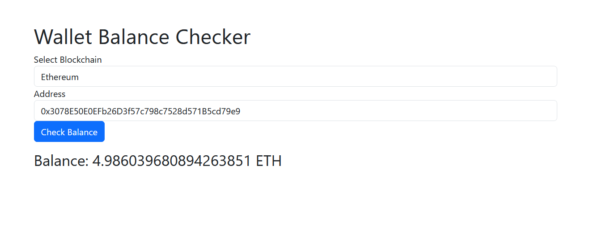

# Wallet Balance Checker

  

## Table Of Content

- [Description](#description)
- [Deployed website link](#deployedWebsite)
- [Installation](#installation)
- [Usage](#usage)
- [Contributing](#contribution)
- [Tests](#tests)
- [GitHub](#github)
- [Contact](#contact)
- [License](#license)

  

## Description

  The Wallet Balance Checker is a web application built using React, enabling users to check the balance of Ethereum wallets across various blockchain networks. This application interacts with the blockchain via Infura, providing a user-friendly interface for balance checking.

Deployed website: <strong><a href="http://blockchaincyberpunk1.github.io/wallet-balance-checker">http://blockchaincyberpunk1.github.io/wallet-balance-checker</a></strong>

   
Check Ethereum wallet balance

## Installation

Getting Started:
To get started with the Wallet Balance Checker, follow these steps:

Clone the repository to your local machine.
Navigate to the project directory.
Run 'npm install' to install all the necessary dependencies.
Run 'npm start' to start the development server. The application should open in your default web browser.

Wallet Balance Checker is built with the following tools and libraries: <ul><li>React: A JavaScript library for building user interfaces.</li><li>Web3.js: A collection of libraries to interact with Ethereum blockchain.</li><li>Bootstrap: A CSS framework for styling and responsive design.</li><li>Node.js: JavaScript runtime for executing code server-side.</li><li>npm (Node Package Manager): Package manager for JavaScript.</li><li>@testing-library/react: Library for testing React components.</li><li>@testing-library/jest-dom: Custom jest matchers to extend jest for DOM testing.</li><li>jest: JavaScript testing framework.</li></ul>

## Usage
 
Open the application in your web browser.
Use the 'Select Blockchain' dropdown to choose the blockchain network you want to interact with.
Enter the Ethereum wallet address in the 'Address' input field.
Click the 'Check Balance' button to retrieve and display the wallet balance.

## Contribution
 
Please read CONTRIBUTING.md for details on our code of conduct, and the process for submitting pull requests to us.

## Tests
 
Pre-requisites:
Ensure that Node.js and npm are installed on your machine.
Make sure all project dependencies are installed by running npm install in the project directory.
Running Unit Tests:
Navigate to the Project Directory: Open a terminal and navigate to the root directory of the Wallet Balance Checker project.

Run the Test Script: Execute the following command to start the test runner:
npm test

Observe Test Output: The terminal will display the test results. Each test will be marked as either passed (✓) or failed (✗).

Review Failed Tests: If any tests fail, review the output to understand what went wrong. The test description and error message should provide insight into what aspect of the functionality is not working as expected.

Fix Issues if Necessary: If there are failed tests, make the necessary changes to the code to fix the issues. After making changes, go back to step 2 to run the tests again.

Check Test Coverage (Optional): If you have set up test coverage reporting for your project, you can run the following command to generate a coverage report:
npm run test:coverage

Review the coverage report to ensure that all parts of your application are covered by tests.

Running End-to-End Tests (If Applicable):
If you have set up end-to-end tests using a tool like Cypress or Selenium, follow these additional steps:

Start the Application: In a separate terminal window, start the application by running:
npm start

Run End-to-End Tests: In another terminal window, execute the command to run your end-to-end tests. This command will depend on the tool you are using. For example, if you are using Cypress, you might run:
npx cypress open

Review Test Results: Observe the test results in the terminal or the tool's user interface. Make sure all tests pass.

Fix Issues if Necessary: If any end-to-end tests fail, review the output, fix any issues, and re-run the tests.

## GitHub

<a href="https://github.com/blockchaincyberpunk1"><strong>blockchaincyberpunk1</a></strong>

Visit my website: <strong><a href="http://blockchaincyberpunk1.github.io/thepolyglot">The Polyglot</a></strong>

## Contact

Feel free to reach out to me on my email:
thepolyglot8@gmail.com

## License

